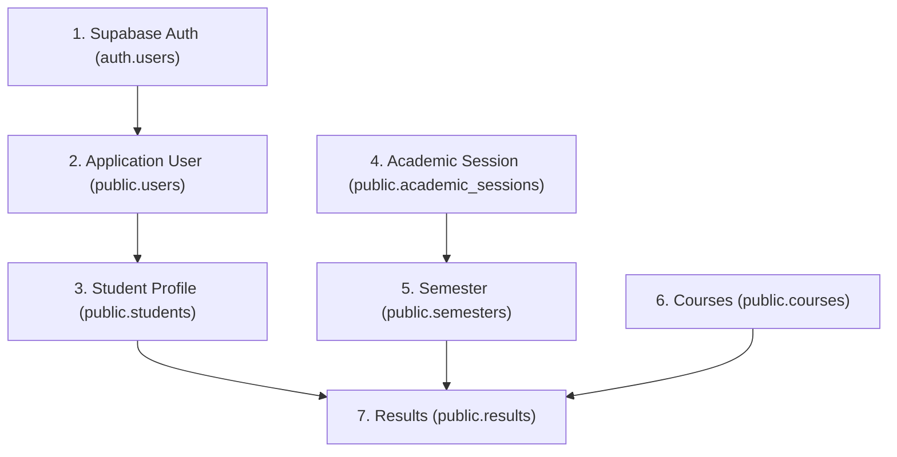

# Phase 3D — Controlled Demonstration Seed Data Specification (Corrected)

**Document Status:** Planning & Specification Draft (Corrected against official course allocation)  
**Scope:** Demonstration dataset for verification of Student Result and Transcript Management Portal  
**Target Environment:** Supabase PostgreSQL & Supabase Auth  
**Primary Source Document:** [`docs/New Second Sem 2024 2025 Course Allocation-1.docx`](file:///c:/Users/USER/Desktop/student-rtm-portal/docs/New%20Second%20Sem%202024%202025%20Course%20Allocation-1.docx)  
**Academic Reference:** Federal Polytechnic, Offa — School of Computing, Networking and Cloud Computing Department (HND 2, Second Semester 2024/2025 Academic Session)

---

## 1. Purpose & Objectives

This specification defines a controlled demonstration dataset strictly matching the official course allocation document for Federal Polytechnic, Offa (Second Semester 2024/2025 Academic Session).

The demonstration dataset allows testing:
1. **Authentication Flow:** Successful student sign-in and application-role lookup (`public.users.role`).
2. **Student Dashboard (Phase 3B):** Display of authenticated student identity, metrics (5 courses recorded, 14 earned credit units, latest session `2024/2025`, latest semester `Second Semester`), and preview of recent results.
3. **Student Profile (Phase 3C):** Read-only rendering of personal identity, academic enrollment details, and contact info.
4. **Student Results Retrieval (Phase 3A):** Complete course listing grouped under `2024/2025 Academic Session — Second Semester` displaying exact course codes, titles, credit units, course types, scores, grades, grade points, and remarks.
5. **Cross-Student Security Isolation:** Row Level Security (RLS) enforcement preventing data leakage across student accounts.

---

## 2. Dependency & Insertion Hierarchy

In accordance with foreign-key relationships defined in [`docs/DATABASE_SCHEMA.md`](file:///c:/Users/USER/Desktop/student-rtm-portal/docs/DATABASE_SCHEMA.md) and [`src/supabase/migration/001_initial_schema.sql`](file:///c:/Users/USER/Desktop/student-rtm-portal/src/supabase/migration/001_initial_schema.sql), records must be created in this strict order:

---

## 3. Demonstration Student Identity

> [!NOTE]
> All student personal data is fictional and created strictly for software verification and project defense demonstration.

### A. Supabase Auth Account (`auth.users`)
- **Email:** `demo.student@fedpoffa.edu.ng`
- **Password:** `DemoStudent2025!` *(set via Supabase Auth dashboard or Admin API)*
- **Value to Obtain:** `auth.users.id` (UUID generated by Supabase upon creation)

### B. Application User Record (`public.users`)

| Column Name | Value | Constraint / Validation |
| :--- | :--- | :--- |
| `user_id` | `<AUTH_USER_UUID>` | PK, References `auth.users(id)` ON DELETE CASCADE |
| `email` | `demo.student@fedpoffa.edu.ng` | UNIQUE, NOT NULL |
| `role` | `student` | CHECK (`role IN ('admin', 'student')`) |
| `status` | `active` | CHECK (`status IN ('active', 'inactive')`) |
| `created_at` | `NOW()` | TIMESTAMPTZ |
| `updated_at` | `NOW()` | TIMESTAMPTZ |

### C. Student Profile Record (`public.students`)

| Column Name | Value | Constraint / Validation |
| :--- | :--- | :--- |
| `student_id` | `gen_random_uuid()` | PK |
| `user_id` | `<AUTH_USER_UUID>` | UNIQUE, FK to `public.users(user_id)` |
| `matric_number` | `FPO/HND/NCC/23/0042` | UNIQUE, NOT NULL |
| `full_name` | `Adewale Emmanuel Johnson` | NOT NULL |
| `date_of_birth` | `2001-05-14` | DATE |
| `gender` | `Male` | TEXT |
| `email` | `demo.student@fedpoffa.edu.ng` | TEXT |
| `phone` | `08031234567` | TEXT |
| `department` | `Networking and Cloud Computing` | TEXT (Profile information) |
| `level_of_enrollment` | `HND 2` | NOT NULL |
| `status` | `active` | CHECK (`status IN ('active', 'inactive')`) |
| `created_at` | `NOW()` | TIMESTAMPTZ |
| `updated_at` | `NOW()` | TIMESTAMPTZ |

---

## 4. Academic Session & Semester Records

Verified directly against `docs/New Second Sem 2024 2025 Course Allocation-1.docx`:
- **Academic Session:** `2024/2025`
- **Semester:** `Second Semester`

### A. Academic Session (`public.academic_sessions`)

| Column Name | Value | Description |
| :--- | :--- | :--- |
| `session_id` | `gen_random_uuid()` *(e.g. `s1111111-1111-1111-1111-111111111111`)* | PK |
| `session_name` | `2024/2025` | UNIQUE, NOT NULL |
| `start_date` | `2024-11-01` | Optional session start date |
| `end_date` | `2025-08-31` | Optional session end date |
| `status` | `active` | Active session |

### B. Semester (`public.semesters`)

| Column Name | Value | Description |
| :--- | :--- | :--- |
| `semester_id` | `gen_random_uuid()` *(e.g. `m2222222-2222-2222-2222-222222222222`)* | PK |
| `session_id` | `<SESSION_ID_FROM_ABOVE>` | FK to `academic_sessions` |
| `semester_name` | `Second Semester` | NOT NULL |
| `semester_order` | `2` | CHECK (`semester_order IN (1, 2)`) |
| `start_date` | `2025-04-01` | Optional semester start date |
| `end_date` | `2025-08-31` | Optional semester end date |
| `status` | `active` | Active semester |

---

## 5. Verified HND 2 Course Records (`public.courses`)

Extracted verbatim from the official course allocation document (`docs/New Second Sem 2024 2025 Course Allocation-1.docx`):

| S/N in Doc | Course Code | Exact Course Title from Allocation Document | L | P | Credit Unit (CU) | Contact Hours (CH) | Course Type | Status |
| :---: | :--- | :--- | :---: | :---: | :---: | :---: | :---: | :---: |
| 1 | `NCC 424` | Internet of Things | 1 | 2 | **3** | 3 | `Required` | `active` |
| 2 | `NCC 421` | Cloud Computing II | 1 | 2 | **3** | 3 | `Required` | `active` |
| 4 | `NCC 422` | Enterprise Networking, Security and Automation | 1 | 3 | **4** | 4 | `Required` | `active` |
| 6 | `NCC 423` | Ethical and Professional Practice in Networking and Cloud Computing | 2 | 0 | **2** | 2 | `Required` | `active` |
| 10 | `EED 423` | Entrepreneurship Practical | 2 | - | **2** | 2 | `Required` | `active` |

**Total HND 2 Courses:** **5 Courses**  
**Total Semester Credit Units:** $3 + 3 + 4 + 2 + 2 = \mathbf{14\text{ Credit Units}}$

> [!IMPORTANT]
> - No synthetic or invented courses (such as fictional project codes or generic electives) have been added.
> - Only courses explicitly allocated to HND 2 / HND II NCC in the source document are included.

---

## 6. Demonstration Student Result Records (`public.results`)

Realistic grades and scores strictly conforming to the 5 verified HND 2 courses:

| Course Code | Course Title | Credit Unit | Score (0..100) | Grade (A..F) | Grade Point (0..5) | Remark |
| :--- | :--- | :---: | :---: | :---: | :---: | :--- |
| `NCC 421` | Cloud Computing II | 3 | 76.50 | `A` | 4.00 | Excellent |
| `NCC 422` | Enterprise Networking, Security and Automation | 4 | 82.00 | `A` | 4.00 | Distinction |
| `NCC 423` | Ethical and Professional Practice in Networking and Cloud Computing | 2 | 71.00 | `B` | 3.50 | Very Good |
| `NCC 424` | Internet of Things | 3 | 78.50 | `A` | 4.00 | Excellent |
| `EED 423` | Entrepreneurship Practical | 2 | 69.00 | `B` | 3.00 | Good |

**Demonstration Dataset Totals:**
- **Total Published Course Results:** 5 Courses
- **Total Registered Credit Units:** 14 Units
- **Grade Distribution:** 3 `A` (Distinction / Excellent), 2 `B` (Very Good / Good)

---

## 7. Foreign-Key Relationships & Integrity Rules

1. `public.users.user_id` $\rightarrow$ `auth.users.id`
2. `public.students.user_id` $\rightarrow$ `public.users.user_id`
3. `public.semesters.session_id` $\rightarrow$ `public.academic_sessions.session_id`
4. `public.results.student_id` $\rightarrow$ `public.students.student_id`
5. `public.results.course_id` $\rightarrow$ `public.courses.course_id`
6. `public.results.semester_id` $\rightarrow$ `public.semesters.semester_id`
7. `UNIQUE (student_id, course_id, semester_id)` constraint prevents duplicate entries for the same course in the same semester.

---

## 8. Row Level Security (RLS) & Workflow Verification Plan

### Test 1: Student Login & Role Resolution
- Sign in with `demo.student@fedpoffa.edu.ng`.
- System resolves role from `public.users` (`role = 'student'`) and redirects to `/student/dashboard`.

### Test 2: Academic Dashboard Verification (Phase 3B)
- **Profile Header:** `Adewale Emmanuel Johnson` (Matric: `FPO/HND/NCC/23/0042`, Department: `Networking and Cloud Computing`, Level: `HND 2`, Status: `Active`).
- **Statistics Cards:**
  - Courses Recorded: `5`
  - Credit Units: `14`
  - Academic Session: `2024/2025`
  - Current Semester: `Second Semester`
- **Recent Results:** Displays the 5 published HND 2 course results.
- **Navigation:** Links to Results, Transcript, and Profile work seamlessly.

### Test 3: Student Profile Verification (Phase 3C)
- Navigate to `/student/profile`.
- Confirms read-only display across Program & Enrolment, Personal Identity, Contact Details, and Record History sections.

### Test 4: Student Results Verification (Phase 3A)
- Navigate to `/student/results`.
- Results grouped under `2024/2025 Academic Session — Second Semester`.
- Table displays all 5 verified courses: `NCC 421`, `NCC 422`, `NCC 423`, `NCC 424`, `EED 423`.

### Test 5: Cross-Student Isolation (Security Test)
- Create Student B with zero results.
- Sign in as Student B and confirm that Student A's 5 results are not accessible or visible.

---

## 9. Scope Boundaries & Policy Reminders

- ❌ **NO database schema or table changes**.
- ❌ **NO lecturer accounts, roles, or workflows**.
- ❌ **NO department-management tables** (department is strictly profile metadata).
- ❌ **NO GPA/CGPA calculation columns or client-side calculation triggers**.
- ❌ **NO static transcript tables**.
- ❌ **NO extraneous institutional modules** (fees, hostel, attendance, library).
