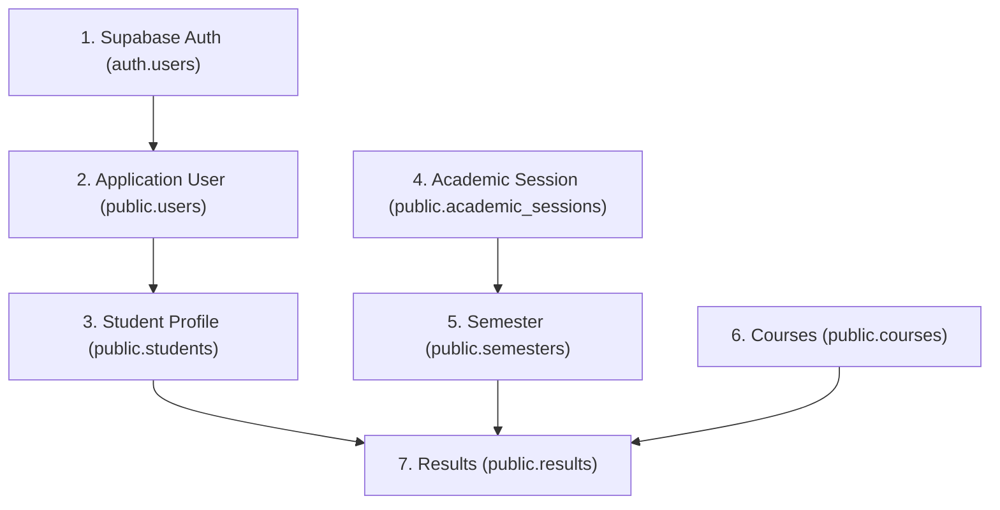

# Phase 3D — Controlled Demonstration Seed Data Specification

**Document Status:** Planning & Specification Draft  
**Scope:** Demonstration data for verification of Student Result and Transcript Management Portal  
**Target Environment:** Supabase PostgreSQL & Supabase Auth  
**Academic Reference:** Federal Polytechnic Offa — Networking and Cloud Computing (HND 2, Second Semester, 2024/2025)

---

## 1. Purpose & Objectives

This specification defines a controlled, realistic demonstration dataset to validate end-to-end student portal workflows without altering the database schema or creating unapproved institutional modules.

The demonstration data will verify:
1. **Authentication Flow:** Successful email/password login and role resolution from `public.users`.
2. **Student Dashboard (Phase 3B):** Profile header, total courses count, total earned credit units, latest session/semester tags, and recent course preview.
3. **Student Profile (Phase 3C):** Read-only rendering of student identity, academic enrollment, communication details, and record history.
4. **Student Results Retrieval (Phase 3A):** Course result listing grouped by academic session and semester, displaying course codes, course titles, credit units, course types, scores, letter grades, grade points, and remarks.
5. **Security & Cross-Student Isolation:** Row Level Security (RLS) validation ensuring students can only access their own records.

---

## 2. Dependency & Insertion Hierarchy

Because foreign-key constraints are strictly enforced in PostgreSQL, data must be inserted in the following dependency sequence:

---

## 3. Demonstration Student Identity

> [!NOTE]
> All student data is completely fictional and designed solely for academic software testing and project defense demonstration.

### A. Supabase Auth Account (`auth.users`)
- **Email:** `demo.student@fedpoffa.edu.ng`
- **Password:** `student3@12345` *(or any secure test credential set in Supabase Auth)*
- **Value to Obtain:** `auth.users.id` (UUID generated by Supabase upon account creation)

### B. Application User Record (`public.users`)

| Column Name | Value | Constraint / Source |
| :--- | :--- | :--- |
| `user_id` | `<AUTH_USER_UUID>` | PK, References `auth.users(id)` |
| `email` | `demo.student@fedpoffa.edu.ng` | UNIQUE, NOT NULL |
| `role` | `student` | CHECK (`role IN ('admin', 'student')`) |
| `status` | `active` | CHECK (`status IN ('active', 'inactive')`) |
| `created_at` | `NOW()` | TIMESTAMPTZ |
| `updated_at` | `NOW()` | TIMESTAMPTZ |

### C. Student Profile Record (`public.students`)

| Column Name | Value | Constraint / Source |
| :--- | :--- | :--- |
| `student_id` | `gen_random_uuid()` | PK |
| `user_id` | `<AUTH_USER_UUID>` | UNIQUE, FK to `public.users(user_id)` |
| `matric_number` | `FPO/HND/NCC/23/0042` | UNIQUE, NOT NULL |
| `full_name` | `Adewale Emmanuel Johnson` | NOT NULL |
| `date_of_birth` | `2001-05-14` | DATE |
| `gender` | `Male` | TEXT |
| `email` | `demo.student@fedpoffa.edu.ng` | TEXT |
| `phone` | `08031234567` | TEXT |
| `department` | `Networking and Cloud Computing` | TEXT (Profile information) |
| `level_of_enrollment` | `HND 2` | NOT NULL |
| `status` | `active` | CHECK (`status IN ('active', 'inactive')`) |
| `created_at` | `NOW()` | TIMESTAMPTZ |
| `updated_at` | `NOW()` | TIMESTAMPTZ |

---

## 4. Academic Session & Semester Records

### A. Academic Session (`public.academic_sessions`)

| Column Name | Value | Description |
| :--- | :--- | :--- |
| `session_id` | `gen_random_uuid()` *(e.g. `s1111111-1111-1111-1111-111111111111`)* | PK |
| `session_name` | `2024/2025` | UNIQUE, NOT NULL |
| `start_date` | `2024-11-01` | Session start |
| `end_date` | `2025-08-31` | Session end |
| `status` | `active` | Active academic session |

### B. Semester (`public.semesters`)

| Column Name | Value | Description |
| :--- | :--- | :--- |
| `semester_id` | `gen_random_uuid()` *(e.g. `m2222222-2222-2222-2222-222222222222`)* | PK |
| `session_id` | `<SESSION_ID_FROM_ABOVE>` | FK to `academic_sessions` |
| `semester_name` | `Second Semester` | NOT NULL |
| `semester_order` | `2` | CHECK (`semester_order IN (1, 2)`) |
| `start_date` | `2025-04-01` | Semester start |
| `end_date` | `2025-08-31` | Semester end |
| `status` | `active` | Active semester |

---

## 5. Course Records (`public.courses`)

Reference: Federal Polytechnic Offa — Networking and Cloud Computing (HND 2, Second Semester).

| Course Code | Course Title | Credit Unit | Course Type | Status |
| :--- | :--- | :---: | :---: | :---: |
| `NCC421` | Cloud Infrastructure and Virtualization | 3 | `Required` | `active` |
| `NCC422` | Network Security and Cryptography | 3 | `Required` | `active` |
| `NCC423` | Cloud Security, Compliance and Migration | 3 | `Required` | `active` |
| `NCC424` | Wireless Networks and Mobile Computing | 2 | `Required` | `active` |
| `NCC425` | Network Automation and Scripting | 2 | `Required` | `active` |
| `EED426` | Practice of Entrepreneurship | 2 | `Required` | `active` |
| `NCC429` | Capstone Project / Dissertation | 6 | `Required` | `active` |

**Total Credit Units Available for Semester:** **21 Units**

---

## 6. Student Result Records (`public.results`)

Realistic grading distribution matching the database constraints (`score 0..100`, `grade in ('A','B','C','D','E','F')`, `grade_point 0..5`):

| Course Code | Course Title | Credit Unit | Score | Grade | Grade Point | Remark |
| :--- | :--- | :---: | :---: | :---: | :---: | :--- |
| `NCC421` | Cloud Infrastructure and Virtualization | 3 | 78.00 | `A` | 4.00 | Excellent |
| `NCC422` | Network Security and Cryptography | 3 | 82.50 | `A` | 4.00 | Distinction |
| `NCC423` | Cloud Security, Compliance and Migration | 3 | 71.00 | `B` | 3.50 | Very Good |
| `NCC424` | Wireless Networks and Mobile Computing | 2 | 68.00 | `B` | 3.00 | Good |
| `NCC425` | Network Automation and Scripting | 2 | 74.00 | `B` | 3.50 | Very Good |
| `EED426` | Practice of Entrepreneurship | 2 | 80.00 | `A` | 4.00 | Excellent |
| `NCC429` | Capstone Project / Dissertation | 6 | 85.00 | `A` | 4.00 | Distinction |

**Summary for Demonstration:**
- **Total Registered Courses:** 7 Courses
- **Total Credit Units:** 21 Credits
- **Grades Distribution:** 4 Distinction/Excellents (`A`), 3 Very Good/Goods (`B`)

---

## 7. Foreign-Key Relationships & Integrity Rules

1. `public.users.user_id` $\rightarrow$ `auth.users.id` (ON DELETE CASCADE)
2. `public.students.user_id` $\rightarrow$ `public.users.user_id` (ON DELETE SET NULL)
3. `public.semesters.session_id` $\rightarrow$ `public.academic_sessions.session_id` (ON DELETE RESTRICT)
4. `public.results.student_id` $\rightarrow$ `public.students.student_id` (ON DELETE CASCADE)
5. `public.results.course_id` $\rightarrow$ `public.courses.course_id` (ON DELETE RESTRICT)
6. `public.results.semester_id` $\rightarrow$ `public.semesters.semester_id` (ON DELETE RESTRICT)
7. **Unique Constraint Protection:** `UNIQUE (student_id, course_id, semester_id)` ensures no duplicate grade records can be created for the same course in the same semester.

---

## 8. Row Level Security (RLS) & Cross-Student Isolation Test Plan

### Test Scenario 1: Demonstration Student Login & Flow
1. Sign in as `demo.student@fedpoffa.edu.ng`.
2. Verify redirect to `/student/dashboard`.
3. Check Dashboard overview metrics:
   - Name: `Adewale Emmanuel Johnson`
   - Matric: `FPO/HND/NCC/23/0042`
   - Department: `Networking and Cloud Computing`
   - Total Courses: `7`
   - Total Credit Units: `21`
   - Academic Session: `2024/2025`
   - Semester: `Second Semester`
4. Navigate to `/student/profile`:
   - Confirm complete read-only presentation of personal identity, enrollment, and contact fields.
5. Navigate to `/student/results`:
   - Confirm table displays all 7 course results with correct course codes, credit units, scores, grades, and remarks grouped under `2024/2025 Academic Session — Second Semester`.

### Test Scenario 2: Cross-Student Isolation Verification
1. Create a second test student account in Supabase Auth (e.g. `student.empty@fedpoffa.edu.ng`) linked to a separate profile in `public.students`.
2. Do not insert any records in `public.results` for Student B.
3. Sign in as Student B:
   - `/student/dashboard` should display `0` recorded courses and `0` credit units with an empty recent results notice.
   - `/student/results` should show the proper empty state (*"No results available yet"*).
   - Confirm that Student B cannot view or leak any of Student A's 7 course results.

---

## 9. Scope Boundaries & Prohibited Items

In adherence to [`docs/MASTER_DEVELOPMENT_SPECIFICATION.md`](file:///c:/Users/USER/Desktop/student-rtm-portal/docs/MASTER_DEVELOPMENT_SPECIFICATION.md):
- ❌ **NO lecturer records or lecturer accounts**.
- ❌ **NO department-management tables** (department is strictly profile metadata).
- ❌ **NO class or course registration tables**.
- ❌ **NO fees, attendance, library, hostel, or payroll data**.
- ❌ **NO GPA or CGPA calculation columns or triggers**.
- ❌ **NO static transcript tables** (transcripts remain dynamically derived records).
- ❌ **NO schema alterations or new columns**.

